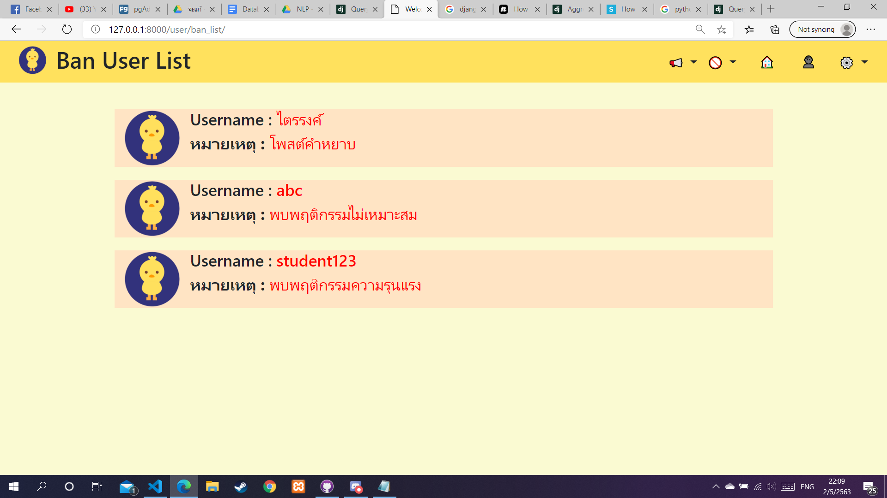

<h1>Project Required :dart:</h1>
<ul>
  <li> Python Version: 3.6 [Recommend]</li>
  <li> Docker Desktop</li>
  <li> Virtual Environment </li>
 </ul>
 
 <h1>Settings [แก้ไขให้ตรงกับของตัวเอง] ⚙</h1>
<h3> >>> ไปที่ mysite/setting</h3>
 <ul> 
  <li><h3>DATABASES</h3></li>
  <li><h3>CHANNEL_LAYERS</h3></li>
</ul> 

<h1>Run command follow by this list 🎮</h1>

  <ul>
  <li><h3>Run in Docker</h3></li>
  </ul>
   <ol>
   <li>docker run -p 6379:6379 -d redis:5 </li>
  </ol>
  <ul>
    <li><h3>Run in Virtual Environment</h3></li>
  </ul>
  <ol>
   <li>pip install -r requirements.txt  *** สำหรับ [macOS] ใน requirements.txt ให้แก้ psycopg2 เป็น psycopg2-binary ***</li>
   <li>python manage.py migrate</li>
  <li>python manage.py createsuperuser  (optional) for create admin user if u want to be admin for django for view in django db, etc(not associate with my project)
and goto localhost:8000/admin
</li>
  <li>python manage.py runserver</li>
 </ol>
 
<h1>ตัวอย่างเว็บไซต์ 💻</h1>

